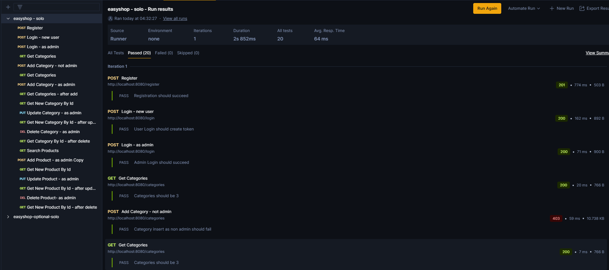
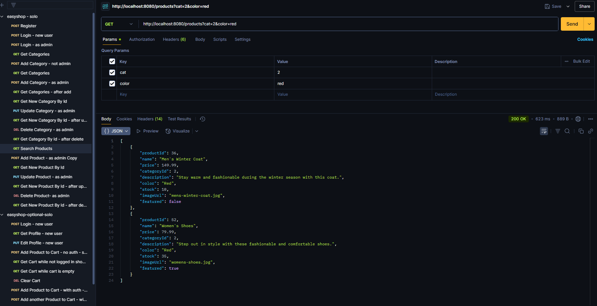
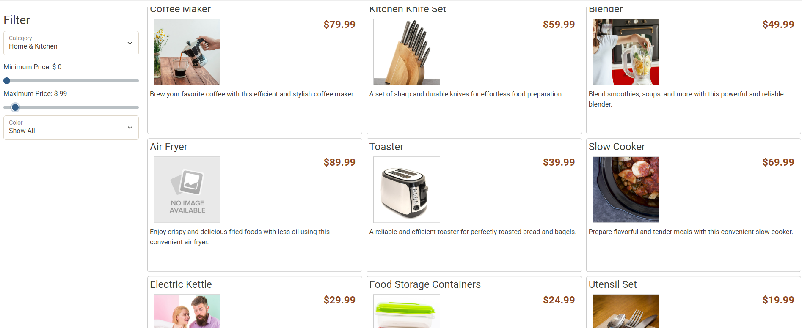
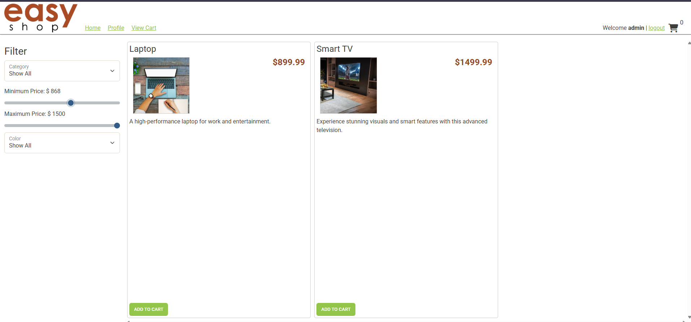

# Easy Shop - Brandon Morse

## The Easy Shop Application is a website that allows users to filter products by name, color and price. The application also allows admin users to add, update and delete categories and products.

## User Stories

- As a user, I want to search by a product's color so that I can make my shopping process easier.

- As a user, I want to search by a product's name so that I can make my shopping process easier.

- As a user, I want to filter my search through a product's minimum and maximum price so that I can make my shopping process easier.

- As an admin, I want to be able to be able to add, update and delete categories and products so that I can keep the easy shop updated.

## Setup

1. Create the CategoriesController class similarly to how the ProductController class is built
2. Fix bugs regarding minimum and maximum price for the web application and duplicate items
3. Update queries inside both MySqlCategoryDao and MySqlProductDao classes to reflect the easy shop database
4. Run query script in POSTMAN and see changes inside MySQL workbench and the easy shop web application

### Prerequisites

- IntelliJ IDEA: Ensure you have IntelliJ IDEA installed, which you can download from [here](https://www.jetbrains.com/idea/download/).
- Java SDK: Make sure Java SDK is installed and configured in IntelliJ.

### Running the Application in IntelliJ

Follow these steps to get your Financial Tracker Application running within IntelliJ IDEA:

1. Open IntelliJ IDEA.
2. Select "Open" and navigate to the directory where you cloned or downloaded the project.
3. After the project opens, wait for IntelliJ to index the files and set up the project.
4. Find the main class with the `public static void main(String[] args)` method.
5. Right-click on the file and select 'Run 'YourMainClassName.main()'' to start the application.

## Technologies Used

- IntelliJ (Amazon Corretto 17.0.14)
- POSTMAN
- MySQL Workbench

## Demo

## Future Work

- Customer Cart Checkout to be Added Soon!

## Resources

- [W3 Schools for Documentation ](https://www.w3schools.com/java/ref_string_format.asp)

## Team Members

- **Brandon Morse** - Application Development (Controller and MySQLDao construction)

## Thanks!

- Thank you to Mr. Raymond for continuous support and guidance!
